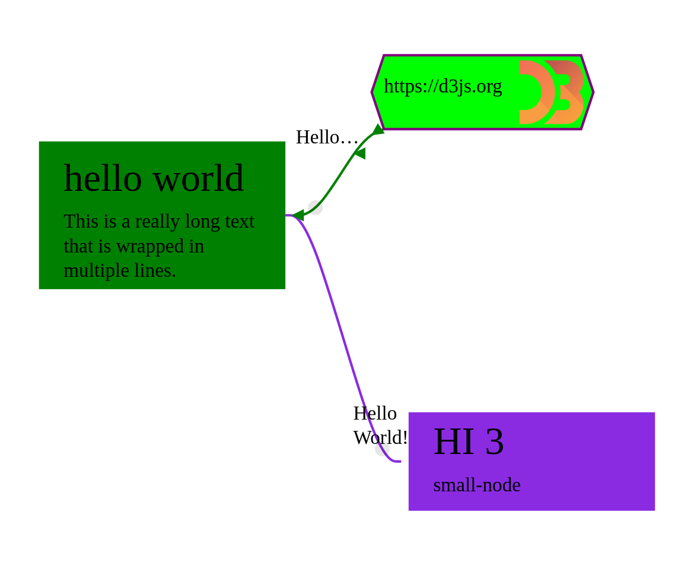

# Grapheditor Webcomponent

This repository contains the grapheditor component developed for the mico project.

The grapheditor is a standalone webcomponent to realize rich graph editors.
It supports templates for nodes, drag and drop, styling with css classes, dynamic node content, edge markers and more.
For a full feature list please consult the documentation on redthedocs.



## Using the library

There is a [Quickstart](https://mico-grapheditor.readthedocs.io/en/stable/quickstart.html) available in the documentation and also a [Demo HTML](docs/example.html) for experimentation.

The library is packaged in three different formats on npm.

Browsercompatibility: The library uses Webcomponents, slots, ResizeObserver and shadow dom. It should work on current Chrome and Firefox browsers.

## Documentation [](https://mico-grapheditor.readthedocs.io/en/latest/?badge=latest)

The full documentation is available on [READTHEDOCS (stable)](https://mico-grapheditor.readthedocs.io/en/stable).
The documentation for the version in development can be found here: [READTHEDOCS (latest)](https://mico-grapheditor.readthedocs.io)

---

## Development

### Running locally

```bash
# install
npm install

# start dev server
npm run start
```

The `test.html` file can be used as a playground to test the features of the grapheditor webcomponent.
The file is served by `npm run start` on port `9009`.

### Compiling the documentation locally

```bash
# install is needed to run typedoc later as part of the sphix build
npm install

cd docs
poetry install
poetry run make html

# debug docs build
poetry run make html SPHINXOPTS="-v"

# list all reference keys of known to sphinx (only available after building the documentation!)
poetry run python -m sphinx.ext.intersphinx _build/html/objects.inv

# update requirements.txt from poetry dependencies
poetry export --format requirements.txt --output requirements.txt
```

The compiled documentation can be found under `docs/_build/html`.

### Publishing to npm

Before publishing to npm make sure to update the versions in the package.json and changelog and run `npm install` again.

```bash
npm run package-all
npm publish
```
