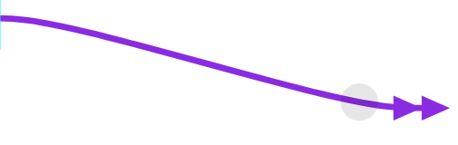
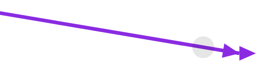
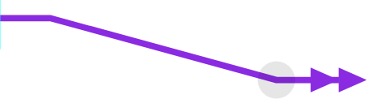
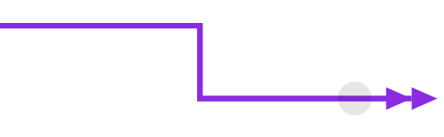

Edge Path Templates
===================

The path of an :js:class:`Edge` can be controlled by using an :js:class:`EdgePathGenerator` together with the :js:attr:`Edge.pathType?`.
The :js:class:`EdgePathGenerator` must be registered in the :js:attr:`GraphEditor.edgePathGeneratorRegistry` before it can be referenced.

The `curves defined by d3 <https://github.com/d3/d3-shape#curves>`_ can be used with the provided :js:class:`SmoothedEdgePathGenerator`.
There is also the :js:class:`SteppedEdgePathGenerator`.

Examples
--------

.. code-block:: typescript

    // standard edge path generator
    new SmoothedEdgePathGenerator(curveBasis, true, 10);

.. code-block:: typescript

    // linear edge path generator
    new SmoothedEdgePathGenerator(curveLinear, false);

.. code-block:: typescript

    // linear edge path generator with offset points
    new SmoothedEdgePathGenerator(curveLinear, true, 10);

.. code-block:: typescript

    // stepped edge path generator
    new SteppedEdgePathGenerator();

