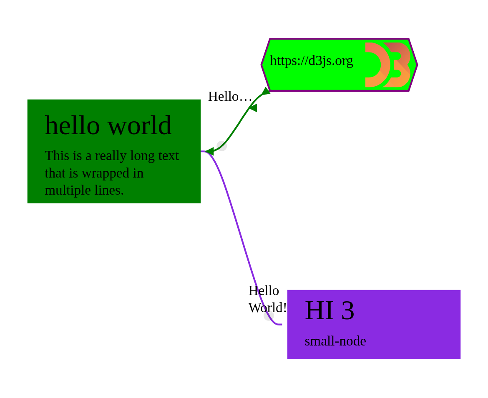

Grapheditor
===========

The grapheditor is a `custom web component <https://www.webcomponents.org>`_ that renders nodes and edges with `d3.js <https://d3js.org>`_.

.. seealso::

    * https://developer.mozilla.org/en-US/docs/Web/Web_Components
    * `d3 <https://github.com/d3/>`_
    * `d3 – select <https://github.com/d3/d3-selection>`_

Quick Start
-----------

Want to jump right in?
Go to the :doc:`quickstart` to get a first feel for how this webcomponent is used.

When to Use
-----------

Use this webcomponent if you want to

* Display an interactive graph layout with complex node designs
* Allow users to rewire the graph interactively
* Render a graph to SVG

When NOT to Use
---------------

Do NOT use this webcomponent if you want to

* Display a large number of complex nodes (everything above 100 nodes should be testet for performance issues)
* Require the best and fastest text wrapping for large amounts of text in nodes
  (Text wrapping is implemented using custom javascript as browsers do not natively support text wrapping in SVGs)

Features
--------

* Custom :doc:`static templates <static-templates>` with dynamic :ref:`text <static-templates:text injection for node templates>` and :ref:`content <static-templates:dynamic content>`
* Fully :doc:`dynamic templates <dynamic-templates>`
* Changeable :doc:`edge paths <edge-path-templates>`
* Dynamic styling with :ref:`css classes <grapheditor:styling nodes and edges with custom css classes>`
* :ref:`Text wrapping <static-templates:text wrapping for node templates>` in plain svg (this is not supported natively by browsers!)
* :ref:`Wrap text in circles and other shapes <static-templates:extra text wrapping options>`
* Pan and zoom using mouse or touch
* :ref:`Highly configurable <grapheditor:component attributes>`
* :ref:`View only mode <view-mode-attribute>`
* Node drag and drop
* Edge drag and drop
* :ref:`Custom edge drag handles <grapheditor:edge drag handles>` for edges and bidirectional edges
* :ref:`Custom markers <grapheditor:edge markers>` for edges (more powerful than svg markers)
* :ref:`Text components <grapheditor:text-components>` for edges
* Powerful :doc:`grouping mechanism <groups>`
* Node :doc:`resizing <resizing>`
* Compatible with all web frameworks (behaves like a standard html tag, see also `custom web component <https://www.webcomponents.org>`_)
* Many :ref:`custom events <grapheditor:component events>`

Documentation
-------------

.. toctree::
    :maxdepth: 2

    quickstart
    coordinates
    grapheditor
    static-templates
    dynamic-templates
    edge-path-templates
    groups
    resizing
    api/api-index
    changelog
